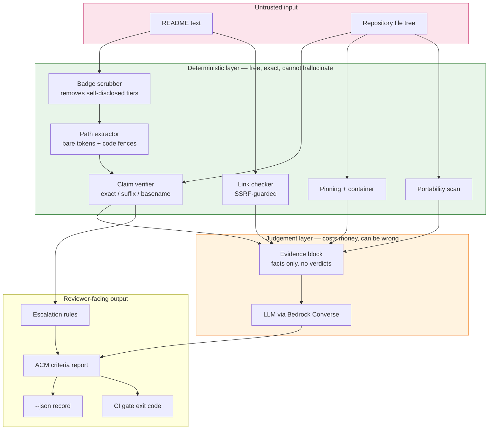
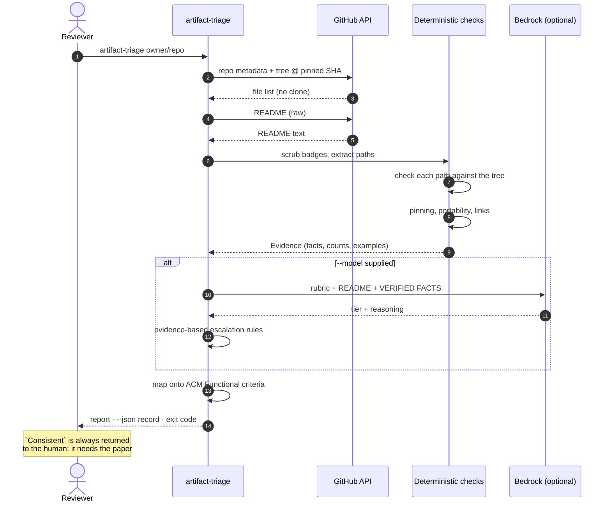

# Artifact Reproducibility Triage

### A deterministic checker that reads a research paper's code repository, verifies every promise its README makes, and hands an artifact-evaluation reviewer a pre-filled decision — with the parts no machine can settle marked as theirs.

[](https://github.com/adarshcod30/artifact-repro-triage/actions/workflows/checks.yml)
[](LICENSE)
[](dataset/)

**Repository** · https://github.com/adarshcod30/artifact-repro-triage
**Dataset** · [742 research artifacts, CC0](dataset/artifact_readme_consistency.csv) · [datasheet](dataset/DATASHEET.md)
**Built for** · micro1 Frontier Engineering Challenge 2026 (Agentic Workflows)

`reproducibility` · `research-artifacts` · `artifact-evaluation` · `acm-badging` · `agentic-workflows` · `llm-evaluation` · `open-science` · `static-analysis`

---

## Table of Contents

- [In plain language](#in-plain-language)
- [The challenge, and how this answers it](#the-challenge-and-how-this-answers-it)
- [Key features](#key-features)
- [Tech stack](#tech-stack)
- [System architecture](#system-architecture)
- [Application flow](#application-flow)
- [Data and evidence pipeline](#data-and-evidence-pipeline)
- [Results](#results)
- [Results that do not flatter this project](#results-that-do-not-flatter-this-project)
- [Prior art, stated up front](#prior-art-stated-up-front)
- [Known limitations](#known-limitations)
- [Deployment and infrastructure](#deployment-and-infrastructure)
- [Project structure](#project-structure)
- [Getting started](#getting-started)
- [Usage reference](#usage-reference)
- [Testing](#testing)
- [Reproducing every number](#reproducing-every-number)
- [Roadmap](#roadmap)
- [Contributing](#contributing)
- [Licence](#licence)
- [Contact](#contact)

---

## In plain language

### The problem, without jargon

When scientists publish a paper, they usually publish their code too, so other
people can check the work. That code comes with a README — an instruction sheet
that says things like *"run `scripts/train.py`, then look in `configs/`"*.

**Very often, those files do not exist.**

It is a recipe that says "add the sauce from step 3" when there is no step 3.
You cannot cook the dish, and you cannot tell whether the meal was ever real.

Somebody is supposed to catch this. At most computer-science conferences,
volunteers review submitted code and award badges for artifacts that work. But
there are far more submissions than volunteers, and published research has
already found that adding these committees **did not measurably improve**
artifact availability — the bottleneck was never the rules, it was that nobody
has the time.

So: a boring, mechanical job that humans are drowning in.

### What this is

A tool you point at any research code repository. It reads the instruction
sheet, checks **every file the instructions mention against the files that are
actually there**, and reports which ones are missing — in about five seconds,
with no API key and at no cost.

Then it hands that verified list to a language model, which writes up a verdict
for the reviewer against the official badge criteria, and clearly marks the one
criterion no machine can answer.

### The finding that makes it worth reading

We took real repositories and **secretly added fake file names** to their
READMEs — files we knew did not exist. Then we asked two systems to judge them.

- A language model reading the README caught **0%**.
- The same model, given a verified list of which paths actually exist, caught **100%**.

Then we tried to break that result three ways, and it held. Most usefully: give
the model a **fake** report saying everything is fine, and its detection
collapses back to zero — proving the *checking* does the work, not the AI being
clever.

And it is not about model power. Re-run on a model **13× cheaper**, and it still
works. Screening an entire conference costs about **three cents**.

### Who it helps

| | |
|---|---|
| **Artifact-evaluation reviewers and chairs** | Triage a whole venue at once with `--json`, instead of one repository at a time |
| **Researchers publishing code** | `--fail-on-findings` drops into CI, so a broken instruction sheet fails the build *before* publication |
| **The wider community** | A public CC0 dataset of 742 research artifacts, with a datasheet that states its own limitations |

---
## The challenge, and how this answers it

The micro1 Frontier Engineering Challenge 2026 asked for an **agentic workflow**
with a measured improvement over a baseline, behind a pass/fail reproducibility
gate. Scoring: agent solution and engineering 30%, end-to-end quality 20%,
measured improvement 15%, reproducibility 15%, problem and user value 15%, hot
take 5%.

### Required deliverables

| # | Requirement | Where it is | Status |
|---|---|---|---|
| 1 | Solution code **+ Improvement Changelog** | [`src/`](src/) · [`CHANGELOG.md`](CHANGELOG.md) — 150 iterations, each an evidence-driven decision | Complete |
| 2 | **Reproduction guide** from a clean environment | [`REPRODUCTION.md`](REPRODUCTION.md) — verified from a fresh clone of the published repo | Complete |
| 3 | **Video ≤ 5 minutes** | [`docs/VIDEO_SCRIPT.md`](docs/VIDEO_SCRIPT.md) — timed to 4:50, figures under the claim checker | Script ready |
| 4 | **Agent trajectories** for every agent used | [`trajectories/`](trajectories/) — 3 product-agent runs + the full build agent, secrets redacted | Complete |

### Additional requirements

| Requirement | How it is met |
|---|---|
| A baseline **and** an advanced solution | Same model, same rubric, same scrubbed input. The only difference is verified evidence. |
| A **meaningful, non-cosmetic** measured gain | 0% → 100% detection, with a placebo control isolating the cause |
| Reproducibility as a pass/fail gate | 12 credential-free `make` targets pass from a clean clone; CI runs them with no secrets |
| Integrity of reported numbers | 46 documented figures machine-verified against `results/*.json` on every run |
| Credentials kept out of the submission | `.env` gitignored; the trajectory exporter refuses to write if any secret pattern survives redaction |

---

## Key features

| Feature | What it does | Cost |
|---|---|---|
| **Deterministic claim verifier** | Checks every file path a README references against the repository's real file tree, via the GitHub API — no clones, no code execution | Free |
| **Verified-evidence prompting** | Feeds established facts to the model instead of asking it to infer them | ~$0.0003 / artifact |
| **ACM criteria mapping** | Maps findings onto `Documented` / `Consistent` / `Complete` / `Exercisable`, quoted verbatim | Free |
| **Refuses what it cannot know** | `Consistent` is marked *not machine-checkable* by construction — it needs the paper | Free |
| **Dependency & container pinning** | Flags floating requirements and unpinned base images, the top cited cause of artifact decay | Free |
| **Portability scan** | Hard-coded home directories, cluster mounts, localhost ports, private IPs | Free |
| **Link-rot checking** | Verifies referenced URLs; refuses loopback and private addresses (SSRF-safe) | Free |
| **Did-you-mean suggestions** | Proposes the most plausible real file for a broken claim | Free |
| **CI gate** | `--fail-on-findings` exits non-zero, so a broken README fails a build | Free |
| **Machine-readable output** | `--json` emits a sortable record per artifact, for triaging a whole venue | Free |
| **Spend ledger + hard ceiling** | Append-only, enforced per API call, fails closed on an unreadable meter | Free |
| **Provenance fingerprinting** | Every result records the code and corpus that produced it; stale numbers are named | Free |

**Five of the six checks require no model at all.**

---

## Tech stack

| Layer | Choice | Why |
|---|---|---|
| Language | Python 3.11+ | Standard library only for the core; no framework needed |
| Package manager | `uv` | Reproducible resolution, fast clean-room installs |
| Model provider | AWS Bedrock (Converse API) | One account end to end; `maxTokens` always explicit |
| Primary model | `us.amazon.nova-pro-v1:0` | Reported headline results |
| Cross-model | `us.meta.llama3-3-70b-instruct-v1:0` | A second, unrelated model family |
| Cross-tier | `us.amazon.nova-2-lite-v1:0` | 13× cheaper — shows the gain is not model capability |
| Data source | GitHub REST API + Zenodo API | Tree API only; nothing is cloned or executed |
| HTTP | `urllib` + `certifi` | No dependency beyond the CA bundle macOS builds omit |
| AWS SDK | `boto3` / `botocore[crt]` | Bedrock Converse |
| Tests | Plain Python, no framework | `make test` runs offline in ~1s with zero third-party deps |
| CI | GitHub Actions | Credential-free; also runs the tool against this repository |

Deliberately **not** used: Docker, a GPU, a database, a web framework, or any
repository clone. The entire analysis runs over API metadata.

---
## System architecture



**In words.** Everything green is ordinary Python: it costs nothing, runs
offline against committed fixtures, and cannot invent a fact. Everything orange
costs money and can be wrong. The whole design is a single asymmetry —
**checking is cheap and exact, judging is expensive and fallible** — so every
checkable thing is moved out of the model, and the model is handed facts instead
of being asked to infer them.

The pink layer is untrusted by construction: this tool is pointed at other
people's repositories, so the scrubber, the SSRF guard and the report escaping
all treat that input as hostile.

---

## Application flow



**Exit codes.** `0` normally; `2` with `--fail-on-findings` when a *positive*
finding exists; `1` for an unusable input or an unreachable repository. "Nothing
to check" never fails a build — measured, that case is 17.9% of real
repositories, and failing them would be a false positive.

---
## Data and evidence pipeline

This is not a model-training project — nothing is trained. The analogous
pipeline is **corpus construction → cleaning → feature extraction → the
experiment → evaluation**, and each stage is reproducible from committed data.

### 1. Data sources and collection

| Source | What is taken | How |
|---|---|---|
| **Zenodo API** | Software deposits matching venue names and the phrases *"replication package"*, *"reproduction package"*, *"artifact evaluation"* | Stratified across publication years 2018–2026 to avoid recency skew |
| **GitHub REST API** | Repository metadata, the recursive file tree at a pinned commit, and the README | Tree API only — **no repository is cloned and no code is executed** |
| **ISSTA 2024 AE page** | Expert-assigned ACM badge labels for 43 artifacts | Parsed from the `data-facet-badge` attribute, not visible text, so it survives theme changes |

766 distinct GitHub repositories were discovered; **742** profiled successfully.
An early design downloaded the Zenodo deposits themselves and was abandoned: the
full corpus was **326 GB**, with a single artifact at 190 GB.

### 2. Cleaning — badge-leakage scrubbing

Many READMEs announce their own ACM tier. Feeding that to a model measures
nothing: it reads the answer instead of judging the work. Before any model sees
anything, badge images, award sentences, tier phrases and AE-committee mentions
are redacted, and **both** systems receive byte-identical scrubbed text.

Two post-conditions run at corpus-build time: nothing matchable survives a
second pass, and no tier word is left orphaned beside a redaction — the exact
signature of a bug where the label was removed and the answer left behind.

### 3. Feature extraction — what counts as a claim

A "claim" is a file path the README references. Extraction is deliberately
conservative:

- an extension whitelist, so version numbers and dotted identifiers are excluded
- URLs stripped first, so another project's files are not counted as this repo's
- `./` stripped, `../` dropped as unverifiable, dotfiles preserved
- the whole document scanned, not only fenced blocks

An **ablation** shows this strictness earns its complexity:

| | Naive | Strict |
|---|---|---|
| Recall on 75 known falsehoods | 100% | 100% |
| Tokens extracted as paths, unmodified READMEs | 300 | 140 |
| Flagged as broken documentation | **188** | **30** |

Identical recall; 158 fewer findings. A checker that reports 188 defects where
30 exist gets switched off, so suppressing the rest is the whole job.

### 4. The experiment — falsified READMEs

Ground truth is exact **by construction**: fabricated file paths are injected
into a real README, so we know precisely what is false. Two systems judge the
result — same model, same rubric, same scrubbed input — differing only in
whether they receive verified facts.

### 5. Evaluation and controls

| Control | Question it answers | Result |
|---|---|---|
| **Negative control** | Does the verifier hallucinate findings? | 75/75 injected falsehoods found, 0 false positives |
| **Placebo evidence** | Is it the evidence, or the prose? | Detection collapses to **0/12 (0%)** |
| **Strong baseline** | Would better prompting close the gap? | **0/13 (0%)** |
| **Subtle mutations** | Does it catch near-misses, not just inventions? | 39 of 43 |
| **Extractor ablation** | Does strictness earn its complexity? | Same recall, 158 fewer findings |
| **Zero-skill constants** | Is the metric informative at all? | It is not — see below |
| **Cross-model** | Is this a property of one model? | Holds on two more families |

---

## Results

### The headline experiment

Inject fabricated paths into a real README; ask each system to judge the artifact.

| | Reads the README | Reads the README **plus verified facts** |
|---|---|---|
| Noticed the fabrication | **0%** | **100%** (3 trials, no variance) |
| Cited the fabrication in its reasoning | 0/60 | 58/60 |

Stated as the head-to-head a reviewer would make:

| Detected the falsified README | Baseline | Solution |
|---|---|---|
| 3 trials, 15 artifacts each | **0%** | **100%** |

### The improvement is not model capability

| | Nova Pro | Llama 3.3 70B |
|---|---|---|
| Baseline detection | **0%** | **0%** |
| Solution detection | **100%** | **100%** |
| Deterministic verifier | 100% | 100% |

And across a **13× price gap**, holding everything else constant:

| | reads the README | reads README + verified facts | price /1M in–out |
|---|---|---|---|
| Nova Pro | 0% | 100% | $0.80 – $3.20 |
| **Nova 2 Lite** | 0% | **94%** | $0.06 – $0.24 |

The expensive model reading prose catches nothing; a model 13× cheaper reading
verified facts catches nearly everything. Whatever produces the improvement, it
is not the model — it is what the model is allowed to reason over.

| Screening cost, verified-evidence pipeline | |
|---|---|
| One judgement | $0.000323 |
| A 100-artifact conference track | $0.032 |
| All 742 artifacts profiled here | $0.24 |

### Three ways this could have been wrong

| Objection | Test | Result |
|---|---|---|
| *"Your baseline is a strawman."* | Tell it explicitly to hunt for contradictions | **0/13 (0%)** — across runs it has scored 0/13, 1/13, 0/13 |
| *"It reads the README, not the evidence."* | Falsified README **plus a placebo report** saying everything resolves | **0/12 (0%)**. The evidence is the cause. |
| *"Your checker flags everything."* | 75 injected false paths | 75/75 found, **0** false positives |

The placebo has been **0/12 in every run**, across every corpus correction and
every model. It is the one number in this project that has never moved.

### Prevalence in the wild

Across **742** published research artifacts (**6,815** documented file references):

| | |
|---|---|
| Carry at least one broken README claim | **55.9%** |
| References resolving to nothing | 1,254 (**18.4%**) |
| Is it decay? | **No** — see below |

### Artifacts ship broken; they do not rot

The literature attributes artifact failure to drift, which predicts that older
artifacts should be worse. They are not.

| Age bucket | n | Median age | Broken-claim ratio | % with a break |
|---|---|---|---|---|
| under 3 months | 307 | 4d | 0.195 | 61% |
| 3-12 months | 86 | 194d | 0.198 | 63% |
| 1-2 years | 44 | 623d | 0.190 | 48% |
| **over 2 years** | **171** | **1,462d** | **0.193** | 46% |

Flat — delta -0.002 across four years, with 171 artifacts averaging four years
since their last push. A measured null, not an absence of data.

### Every ecosystem, not just Python

| Ecosystem | n | Broken-claim ratio | % affected |
|---|---|---|---|
| Notebook | 20 | 0.104 | 30% |
| Python | 284 | 0.189 | 58% |
| C/C++ | 98 | 0.256 | 65% |
| R | 30 | 0.264 | 63% |
| JS/TS | 36 | 0.292 | 67% |
| Shell | 48 | 0.302 | 63% |
| Java | 59 | 0.340 | 78% |
| Rust | 19 | 0.364 | 74% |

Java and Rust are roughly twice as bad as Python. A plausible reading is
directory depth: `src/main/java/com/org/Thing.java` gives a README far more path
to get wrong than `train.py` does.

---
## Results that do not flatter this project

Reported because omitting them would make everything else less trustworthy.

### A zero-skill constant beats both systems

| System | MAE, scored answers only | MAE, full coverage | Deterministic? |
|---|---|---|---|
| Constant predictor, always `"Functional"` | 0.667 | 0.667 | yes — no model, no input |
| Baseline | 0.800 (15 of 15) | 0.800 | no |
| Solution | 0.800 (10 of 15) | **1.067** | no |

**Read the second column.** Every rate excludes escalated items, and the
solution escalates 5 of 15 — so it is scored on the 10 it chose to answer while
the baseline is scored on all 15. Scoring its *identical* answers over the full
corpus gives **1.067**. A system that answers fewer questions is not thereby
better, and `make eval` now prints both denominators and refuses to present the
columns as comparable.

The badge-agreement evaluation is uninformative here: the committee badged the
curated Zenodo deposit, we analyse the living GitHub mirror. The original
experiment was abandoned rather than quietly dropped — and the baseline wins
partly by collapsing onto the middle class, predicting `Functional` for 13 of 15
artifacts.

### The external validation returned null

Repositories we flag are no more likely to carry a user complaint than ones we
do not — and on the latest sample the point estimate runs the *other* way.

| | Flagged | Clean |
|---|---|---|
| Share with a reproduction complaint | 26.1% | 41.7% |
| Repositories with any issues at all | 23 / 60 | 12 / 60 |

The reversal rests on 6 complaints out of 23 versus 5 out of 12. **only 35 of 120 repositories**
have any issues at all, so the instrument cannot resolve the question in either
direction. That is arguably the more useful finding: research artifacts are not
used enough for user complaints to be a signal.

### The subtle-mutation control is harder, and we do worse

Mutating references the way they actually go stale — `run.py` → `run_v2.py` —
rather than inventing them:

| | |
|---|---|
| Mutations introduced | 43 |
| Detected as broken | **39 (91%)** |
| Correct original file suggested | **32 (74%)** |

### What "resolves" actually means

Our definition is **deliberately lenient**: a path counts as resolving if it
exists exactly, *or* if any real path ends with it, *or* if any file anywhere
shares its basename. So `src/train.py` scores correct when the file lives at
`experiments/train.py`.

| How the 6,815 claims resolved | | |
|---|---|---|
| `exact` — works as written | **2,833** | 41.6% |
| `directory` — a directory reference matched a directory | 602 | 8.8% |
| `suffix` — found somewhere else in the tree | **2,007** | 29.4% |
| `basename` — a file of that name exists *somewhere* | 111 | 1.6% |
| **broken — not found at all** | **1,254** | 18.4% |

**2,118 of 5,561 resolutions (38.1%)** did not work as written. Two consequences:
the reported broken rate is a **lower bound**, and this corpus is **not a fair
label set** for a competing detector that flags relocated files. Both are stated
in the [datasheet](dataset/DATASHEET.md), where a benchmarker will actually read
them.

---

## Prior art, stated up front

**The path-checking mechanism is not novel.**

- [READU](https://arxiv.org/abs/2607.15780) (2026) detects README-vs-repository inconsistencies at 75% precision over 6,000 commits from Linux and Spring Boot — **and repairs them**, with 44 confirmed real-world fixes.
- [Tan, Wagner & Treude](https://doi.org/10.1007/s10664-023-10397-6) (EMSE 2023) detect outdated code-element references across 3,000+ projects.

A reviewer who knows this literature will recognise the verifier immediately,
and should. What remains after removing everything prior work established:

1. **A causal comparison against an LLM reading prose**, with a placebo control. Neither prior system tests whether a model can substitute for verification.
2. **Prevalence in research artifacts at population scale.** Prior work measures general open source, or detection precision on a commit sample.
3. **Output addressed to the artifact-evaluation reviewer**, mapped onto the named ACM criteria — including the one criterion the tool refuses to answer.

### "Why not just use lychee?"

[lychee](https://github.com/lycheeverse/lychee) and
[remark-validate-links](https://github.com/remarkjs/remark-validate-links) are
mature and widely adopted, and both check local file references in Markdown. But
they are *Markdown link* checkers — they parse `[text](path)`. A README saying
*"run `scripts/train.py` with the config in configs/default.yaml"* contains two
file references and **zero** Markdown links.

| Of the 1,254 broken claims this project finds | |
|---|---|
| Inside `[text](path)` syntax — a link checker could see them | **55 (4.4%)** |
| **Bare tokens in prose or code fences — invisible to it** | **1,199 (95.6%)** |

A syntactic upper bound: lychee was not executed, so the true gap is if anything
larger. Reproduce with `make linkgap`.

### The problem is documented, not assumed

| Finding | Source |
|---|---|
| Only **39.70%** of 106 assessed artifacts were completely accessible | Guevara-Vega et al., [JSS 2024](https://doi.org/10.1016/j.jss.2024.112187) |
| README quality in SE research artifacts averaged **49.8%** across 2017–2022 | [arXiv 2404.06852](https://arxiv.org/pdf/2404.06852) |
| **71.1%** of 2,702 Python builds unreproducible from dependency errors | Mukherjee et al., [ISSTA 2021](https://doi.org/10.1145/3460319.3464797) |
| Across ~750 papers: no significant change in artifact availability after AECs | Olszewski et al., [CCS 2023](https://doi.org/10.1145/3576915.3623130) |
| Recommend evaluating artifacts *"at the time of publication"* | Arvan, Pina & Parde, [EMNLP 2022](https://doi.org/10.18653/v1/2022.emnlp-main.150) |

Full treatment in [RELATED_WORK.md](RELATED_WORK.md).

---
## Known limitations

Found by running the tool on itself (`make selfcheck`) and by adversarially
auditing every module.

**Quotations are indistinguishable from claims.** All six "broken paths" this
tool reports in its own README are quotations of *other* artifacts' files —
`scripts/run_lpr.py` belongs to LPR and appears as example output. They are
declared in `.artifact-triage-ignore`, and the report states the exception's
impact in the only honest form: **how much it hides, not how many patterns
exist**.

```
*14 author-declared exception pattern(s) from `.artifact-triage-ignore`
 suppressed **6 of 26** referenced path(s) (23%).*
```

A single `*` would suppress everything, so a count of patterns discloses
nothing. Above 50% the report says plainly that the result is author-filtered
rather than a clean bill of health. Since the repository being assessed writes
that file, this makes the bypass **visible** — not impossible.

**A method call that looks like a filename is read as one.** `r.json()` in a
Python example becomes the path `r.json`. Measured: 1 of 1,254 broken claims
(0.08%) — research READMEs rarely carry API-call examples. Documented rather
than fixed, because the extractor is a provenance influencer and changing it
would invalidate all twelve results with no budget left to re-certify them. A
characterisation test pins the current behaviour so it stays recorded.

**Nothing is executed.** A resolved path is not a working artifact. This
measures documentation consistency only, and `Exercisable` is reported as a
necessary condition, never a sufficient one.

**The sample is not random.** A keyword sample of Zenodo software deposits with
a GitHub mirror, stratified by publication year. Deposits without a GitHub link
are absent and may differ systematically.

**No user study.** There is no evidence that a reviewer is measurably faster
with this — only that the output is addressed to their decision.

---

## Deployment and infrastructure

There is no server. The tool is a CLI plus a set of `make` targets, and the
"deployment" is the CI that guards it.

| Concern | How |
|---|---|
| **CI** | GitHub Actions on every push and PR, on a clean Ubuntu runner with **no credentials** |
| **What CI asserts** | Regression suite; deterministic verifier byte-identical; all documented numbers match `results/*.json`; negative control still 75/75 with 0 false positives; **the tool run against this repository with the CI gate on** |
| **Environments** | One. Dev runs and reported runs are the same runs, against the same Bedrock account. |
| **Secrets** | `.env`, gitignored. The trajectory exporter refuses to write if any secret pattern survives redaction. |
| **Cost control** | Append-only ledger; ceiling enforced **per API call**, not once per run; fails closed on an unreadable meter |
| **Monitoring** | `make spend` reports cumulative spend against the ceiling with threshold alerts |
| **Data durability** | `make discover` refuses to shrink an existing corpus; the label rebuild refuses to write an empty file; cache writes are atomic |
| **Result integrity** | Every result carries a code + corpus fingerprint; `make check-claims` names anything stale and exits non-zero if a results file is missing |

### Using it as a CI check in your own repository

```yaml
- run: pip install -e .
- run: artifact-triage ${{ github.repository }} --fail-on-findings
```

That is the *"evaluate at the time of publication"* recommendation from Arvan et
al., implemented. This repository runs exactly that against itself, and it
passes.

---

## Project structure

```
artifact-repro-triage/
├── src/artifact_triage/
│   ├── cli.py                    # entry point: report, --json, --fail-on-findings
│   ├── common/
│   │   ├── llm.py                # provider abstraction (Bedrock / Anthropic / Gemini / Grok)
│   │   ├── budget.py             # ceiling enforced per call, fails closed
│   │   ├── ledger.py             # append-only spend record
│   │   ├── provenance.py         # code + corpus fingerprints, staleness detection
│   │   └── rubric.py             # the shared prompt both systems receive
│   ├── corpus/
│   │   ├── sources.py            # ISSTA badge labels via data-facet-badge
│   │   ├── zenodo.py             # deposit → GitHub slug resolution
│   │   ├── discover.py           # stratified Zenodo harvest
│   │   ├── github.py             # API + atomic, self-healing cache
│   │   ├── fetch.py              # fact sheets: tree + README, zero disk
│   │   └── scrub.py              # badge-leakage redaction + post-conditions
│   ├── solution/
│   │   ├── verify.py             # THE CORE: claim checking, suggestions, ignores
│   │   ├── evidence.py           # the facts-only block given to the model
│   │   ├── criteria.py           # ACM Functional mapping
│   │   ├── escalate.py           # evidence-based escalation rules
│   │   ├── pinning.py            # dependency + container pinning
│   │   ├── portability.py        # machine-specific paths and addresses
│   │   └── links.py              # link rot, SSRF-guarded
│   ├── baseline/run.py           # the fair baseline
│   └── eval/                     # 16 modules: the experiments and their exports
├── tests/test_regressions.py     # one test per fixed defect
├── scripts/                      # check_claims, verify_targets, trajectory export
├── data/
│   ├── fixtures/                 # 15 labelled artifacts, committed
│   ├── cache/                    # API responses, so the pipeline runs offline
│   └── discovered.jsonl          # 766 harvested repositories
├── results/                      # every experiment output, provenance-stamped
├── dataset/                      # CC0 release + datasheet
├── trajectories/                 # required deliverable: agent trajectories
├── docs/VIDEO_SCRIPT.md          # required deliverable: the 5-minute script
├── CHANGELOG.md                  # required deliverable: 150 iterations
├── REPRODUCTION.md               # required deliverable: clean-room guide
└── RELATED_WORK.md               # prior art and threats to validity
```

---
## Getting started

### Prerequisites

| | |
|---|---|
| OS | macOS or Linux |
| Python | 3.11 or newer |
| Disk | ~180 MB (88 MB clone + virtualenv) |
| Network | Only for live repositories and model calls. Every reported result replays from committed caches. |
| Credentials | **None** for the deterministic path. One model provider for `--model`. |

No Docker, no GPU, no repository clones.

### Installation

```bash
git clone --depth 1 https://github.com/adarshcod30/artifact-repro-triage.git
cd artifact-repro-triage
pip install uv
uv venv && uv pip install -e .
```

Use `--depth 1`: the history carries API-cache files that were later removed.

### Environment variables

Only needed for `--model` and the paid experiments. Copy the template and fill
in **one** provider:

```bash
cp .env.example .env
```

```bash
AWS_ACCESS_KEY_ID=...
AWS_SECRET_ACCESS_KEY=...
AWS_REGION=us-east-1
ARTIFACT_TRIAGE_PROVIDER=bedrock
ARTIFACT_TRIAGE_MODEL=us.amazon.nova-pro-v1:0
ARTIFACT_TRIAGE_BUDGET_USD=7.00      # optional; the ceiling, enforced per call
ARTIFACT_TRIAGE_TRIALS=3             # optional; trials per experiment
```

The IAM principal needs `bedrock:InvokeModel` on the model, and model access
must be enabled in the Bedrock console for that region.

### Run locally

```bash
artifact-triage owner/repo                       # ~5s, no key, no cost
artifact-triage https://github.com/owner/repo/tree/main   # any pasted URL form
artifact-triage owner/repo --json                # machine-readable record
artifact-triage owner/repo --fail-on-findings    # exits 2 on a real finding
artifact-triage owner/repo --model               # adds a tier assessment (needs credentials)
```

---

## Usage reference

### CLI

| Flag | Effect |
|---|---|
| *(none)* | Markdown report to stdout |
| `--json` | One sortable JSON record per artifact — for triaging a venue |
| `--fail-on-findings` | Exit `2` on a positive finding. Absence of evidence never fails a build. |
| `--no-links` | Skip URL checking (offline / fast) |
| `--model` | Add the model's tier assessment and escalation decision |
| `-o FILE` | Write to a file instead of stdout |

### `--json` schema

```json
{
  "artifact_id": "owner/repo",
  "commit": "1cd376048ae5",
  "readme_present": true,
  "verified":   { "claims_total": 17, "claims_broken": 15, "broken_paths": [...],
                  "case_mismatches": [...], "suggestions": {...} },
  "pinning":    { "manifest": "requirements.txt", "pinned": 3, "floating": 11 },
  "container":  { "dockerfile": "Dockerfile", "unpinned": ["python:latest"] },
  "portability":{ "files_scanned": 12, "n_findings": 2, "findings": [...] },
  "links":      { "urls_checked": 9, "urls_dead": 1 },
  "acm_functional": [ { "criterion": "Complete", "verdict": "concerns",
                        "mechanical": true, "from_absence": false,
                        "evidence": [...], "needs_human": "..." } ],
  "acm_summary": "Mechanical evidence raises concerns against: Complete…"
}
```

### Make targets

| Target | Cost | What it does |
|---|---|---|
| `make test` | free | Regression suite, offline, ~1s |
| `make verify` | free | Deterministic verifier over the fixtures |
| `make control` | free | Negative control — 75 injected falsehoods |
| `make subtle` | free | Near-miss mutation control |
| `make ablation` | free | Naive vs strict extractor |
| `make pinning` / `portability` | free | Environment checks |
| `make linkgap` / `resolution` | network | The lychee gap; our own leniency |
| `make prevalence` | network | The 742-artifact sweep |
| `make dataset` / `dashboard` | free | CC0 release; self-contained HTML |
| `make check-claims` | free | **Verify every documented number against `results/*.json`** |
| `make baseline` / `solution` / `falsified` | paid | The experiments |
| `make falsified-model MODEL=… OUT=…` | paid | Any cross-model run, with save/restore |
| `make repro` | mixed | The one command a judge runs |

---

## Testing

```bash
make test          # 222 regression tests, no credentials, ~1s
make check-claims  # 46 documented numbers verified against results/*.json
make verify-targets
```

Every test corresponds to a **real defect found during development**, not a
hypothetical. A changelog entry is a claim; a test makes it enforceable. The
suite also polices the write-up itself:

- every documented number matches its results file
- every **bolded** figure is either checked or explicitly declared unchecked
- no README link points at a missing file; no TOC anchor is broken
- the video script's spoken figures match the data
- every Makefile target is either run or documented as gated
- no committed cache file is corrupt; no foreign project's data is in the trajectories

---

## Reproducing every number

```bash
make repro
```

Verified from a **fresh clone of the published repository** — new directory, new
virtualenv, no cached state, no credentials. All twelve credential-free targets
pass, and the installed entry point produces a report.

Total model spend for the entire project: **$6.87**, against a ceiling raised
three times with explicit authorisation ($5.00 → $5.50 → $6.25 → $7.00), each
raise buying a re-measurement that a core-logic fix had made necessary.

Every result records the code and corpus that produced it. `make check-claims`
prints *"Every result was produced by the current code"* only when that is true,
and names anything stale otherwise.

---

## Roadmap

| | |
|---|---|
| **Repair, not just detection** | READU repairs what it finds; this only reports and suggests |
| **A user study** | Measure whether a reviewer is actually faster, which is currently unevidenced |
| **`--local` mode** | Check a working tree pre-commit, without the GitHub API |
| **Exact-match label subset** | Publish the 2,833 `exact` resolutions as a stricter benchmark set |
| **Venue-scale pilot** | Run against a real AE track and compare against the committee's own outcomes |

---

## Contributing

Issues and pull requests welcome. Two house rules, both enforced by tests:

1. **Every claim is checkable.** If you add a number to the documentation,
   register it in `scripts/check_claims.py` or declare it unchecked with a reason.
2. **Every fix gets a regression test** that names the original defect, and a
   `CHANGELOG.md` entry recording the evidence that prompted it.

```bash
make test && make check-claims && make verify-targets
```

---

## Licence

Code: [MIT](LICENSE). Dataset: **CC0**. The underlying repositories retain their
own licences; only public data was used, and no credentials or personal
information are included.

---

## Contact

Adarsh Dwivedi · [github.com/adarshcod30](https://github.com/adarshcod30)

Built for the micro1 Frontier Engineering Challenge 2026. If you know of prior
work this project failed to cite, that is a gap in our search rather than a
claim of novelty against it — please open an issue.
