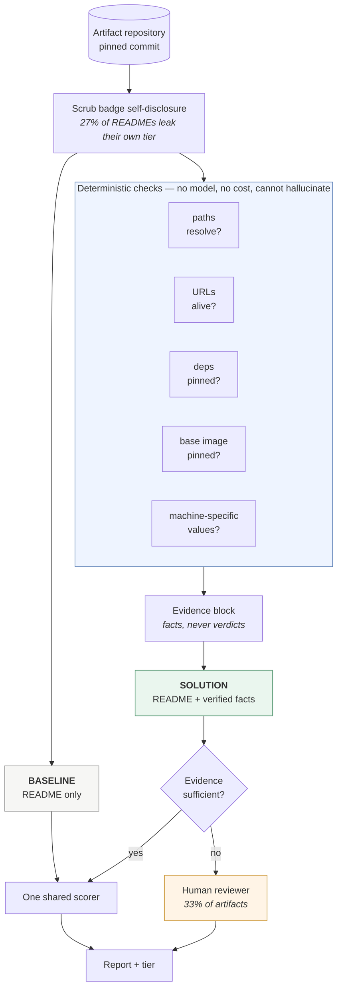

# Artifact Reproducibility Triage

**An LLM shown a README containing fabricated file paths accepts it every time.
Shown the same README plus verified facts, it catches the fabrication every
time.** This repository is the experiment that establishes that, the control
that proves the evidence — not the prose — is doing the work, and the tool that
falls out of it.

Built for the micro1 Frontier Engineering Challenge 2026.

---

## The experiment

Take a real research repository. Secretly inject file paths into its README that
do **not** exist. Ground truth is exact by construction: we know what we faked.
Now ask two systems to judge the artifact — same model, same rubric, same
scrubbed input. The only difference is what they are given to reason over.

| | Reads the README | Reads the README **plus verified facts** |
|---|---|---|
| Noticed the fabrication | **0%** | **96%** (3 trials, 88%–100%) |
| On a second model family (Llama 3.3 70B) | **0%** | **100%** |
| On a model **13× cheaper** (Nova 2 Lite) | **0%** | **100%** (3 trials, no variance) |
| Cited the fabrication in its reasoning | **0/60** | **53/60** |

### The improvement is not model capability

The rows above hold capability constant — same model on both sides — so a
sceptic can still say *"you prompted it better."* So we varied capability
instead, across a **13× price gap**:

| | reads the README | reads README + verified facts | price /1M in–out |
|---|---|---|---|
| Nova Pro | **0%** | 96% | $0.80 – $3.20 |
| **Nova 2 Lite** | 0% | **100%** | **$0.06 – $0.24** |

**The expensive model reading prose catches nothing. A model 13× cheaper reading
verified facts catches everything.** Whatever produces the improvement, it is
not the model — it is what the model is allowed to reason over. That is the
placebo result confirmed from the opposite direction.

It also makes the tool affordable at the scale the problem actually has:

| Screening cost, verified-evidence pipeline | |
|---|---|
| One judgement | **$0.000323** |
| A 100-artifact conference track | **$0.032** |
| All 742 artifacts profiled here | **$0.24** |

A programme chair can screen an entire conference for **three cents**.
Reproduce with `make falsified-cheap`.

Three ways this could have been wrong, all tested:

| Objection | Test | Result |
|---|---|---|
| *"Your baseline is a strawman."* | Tell it explicitly to hunt for internal contradictions | **0/13 (0%)** — across three runs it has scored 0/13, 1/13, 0/13: prompting recovers almost none of the gap |
| *"It's reading the README, not the evidence."* | Give it the falsified README **plus a placebo report** claiming everything resolves | Detection collapses to **0/12**. The evidence is the cause. |
| *"Your checker just flags everything."* | 75 injected false paths across the corpus | **75/75 found, 0 false positives** |

The placebo is the one that matters. It could have falsified the project's
central claim rather than merely qualifying it, and it is the reason this is a
causal statement instead of a correlation.

## Why this is worth knowing

Because the checking half is **free, deterministic and exact**, and the model
cannot do it at any price.

Verifying a documented path costs nothing and cannot hallucinate. Judging
whether an artifact is fit to publish needs a human. Everything in between is
where a language model earns its keep — but only if you hand it facts instead of
asking it to invent them. That division is the whole design.

## How common is the defect?

Across **742 published research artifacts** (6,815 documented file references):

| | |
|---|---|
| Carry at least one broken README claim | **55.9%** |
| Documented references resolving to nothing | **1,254 of 6,815 (18.4%)** |
| Is it decay? | **No** — flat across four years. Artifacts *ship* broken. |
| Ecosystems affected | All of them (Rust 0.36 → Notebook 0.10) |

## The tool

```bash
artifact-triage owner/repo                  # ~5 seconds, no API key, no cost
artifact-triage owner/repo --json           # sortable record, for triaging a venue
artifact-triage owner/repo --fail-on-findings   # exits non-zero: drop it in CI
```

[](https://github.com/adarshcod30/artifact-repro-triage/actions/workflows/checks.yml)

CI runs the regression suite, the deterministic verifier and the negative control
on a clean Ubuntu runner with **no credentials**, asserts the control still
reports 75/75 with 0 false positives, and **runs the tool against this repository
with the CI gate on**. The core claims are verified on a machine that is not mine.

## What "resolves" actually means — an audit of our own leniency

The headline says 18.4% of documented references resolve to nothing. That number
is only as good as the definition of *resolve*, and ours is **deliberately
lenient**. `check_claim` accepts a path if it exists exactly, or if any real path
**ends with** it, or if any file anywhere in the tree **shares its basename**.

So a README saying `src/train.py` is scored correct when the file actually lives
at `experiments/train.py`. The instruction a reader would follow does not work,
and we count it as fine.

| How the 6,815 claims resolved | | |
|---|---|---|
| `exact` — works as written | **2,833** | 41.6% |
| `directory` — a directory reference matched a directory | 602 | 8.8% |
| `suffix` — found somewhere else in the tree | **2,007** | 29.4% |
| `basename` — a file of that name exists *somewhere* | 111 | 1.6% |
| `case-mismatch` — reported separately, never silently | 8 | 0.1% |
| **broken — not found at all** | **1,254** | **18.4%** |

**2,118 of 5,561 resolutions (38.1%)** did not work as written.

Two consequences, neither visible from the headline:

1. **The reported 18.4% is a lower bound.** The rate at which a documented path
   fails *as a reader would follow it* is materially higher.
2. **This corpus is not a fair label set for a competing detector.** A tool that
   correctly flags a relocated file would be scored a false positive against
   our labels. Anyone benchmarking against
   [the dataset](dataset/artifact_readme_consistency.csv) needs to know that.

The leniency is still the right choice for a tool whose headline is *zero false
positives* — flagging a file that plainly exists somewhere is the most annoying
error a checker can make. But it is a choice, and it is now measured rather than
assumed. Reproduce with `make resolution`.

## "Why not just use lychee?"

The fair objection, answered with a number instead of an argument.

[lychee](https://github.com/lycheeverse/lychee) and
[remark-validate-links](https://github.com/remarkjs/remark-validate-links) are
mature, widely adopted, and both check that local file references in Markdown
resolve. They are genuine prior art for part of this problem.

But they are *Markdown link* checkers. They parse `[text](path)`, because that
is what a Markdown parser yields. A README that says

> Run `scripts/train.py` with the config in configs/default.yaml

contains two file references and **zero Markdown links**. There is nothing to
parse, so there is nothing to check.

Measured across the corpus:

| Of the 1,254 broken claims this project finds | |
|---|---|
| Inside `[text](path)` syntax — a link checker could see them | **55 (4.4%)** |
| **Bare tokens in prose or code fences — invisible to a link checker** | **1,199 (95.6%)** |

**Ninety-six percent of the defect is out of reach of the existing tools**, not
because they are bad, but because research READMEs document files the way people
write, not the way Markdown links them.

*Method, and its limit:* this is a **syntactic upper bound** on what a Markdown
link checker can parse — lychee and remark-validate-links were **not executed**.
Seeing a link is necessary to check it, not sufficient, so the true gap is if
anything larger. Reproduce with `make linkgap`.

## What is not new here, stated up front

**The path-checking mechanism is prior art.**
[READU](https://arxiv.org/abs/2607.15780) (2026) detects README-vs-repository
inconsistencies at 75% precision over 6,000 commits from Linux and Spring Boot —
**and repairs them**, with 44 confirmed real-world fixes.
[Tan, Wagner & Treude](https://doi.org/10.1007/s10664-023-10397-6) (EMSE 2023)
detect outdated code-element references across 3,000+ projects. A reviewer who
knows this literature will recognise the verifier immediately, and should.

What remains after removing everything prior work established:

1. **The causal comparison above.** Neither prior system tests whether a language
   model can substitute for verification, and neither has a placebo control.
2. **Prevalence in research artifacts at population scale.** Prior work measures
   general open source, or detection precision on a commit sample. Nobody reports
   the rate for research artifacts.
3. **Output addressed to the artifact-evaluation reviewer**, mapped onto the
   named ACM criteria — including the one criterion the tool **refuses** to
   answer, because settling it requires reading the paper.

The contribution is **measurement and framing, not the detector**.
[RELATED_WORK.md](RELATED_WORK.md) is the long version.

## Results that do not flatter the project

Reported because omitting them would make everything else less trustworthy:

- A **zero-skill constant predictor beats both systems** on ACM badge agreement
  (0.667 vs 0.733 and 0.700). That evaluation is uninformative here, and the
  original experiment was abandoned rather than quietly dropped.
- The **external validation returned null.** Repositories we flag are no more
  likely to carry a user complaint than ones we do not — and on the latest sample
  the point estimate runs the *other* way. Only 29% of repositories have any
  issues at all, so the instrument cannot resolve it in either direction.
- **Model spend for the entire project: $6.10** against a $6.25 ceiling, because
  five of six checks need no model at all.

---

## Contents

- [Who has this problem](#1-who-has-this-problem)
- [What bottleneck makes it worth solving](#2-what-bottleneck-makes-it-worth-solving) · [published evidence](#this-is-a-documented-problem-not-an-assumed-one)
- [Does the agent solve it well](#3-does-the-agent-solve-it-well) · [ACM badge criteria](#the-report-answers-the-reviewers-actual-checklist) · [measured result](#measured-result) · [honest negative result](#honest-negative-result)
- [Prevalence across 742 artifacts](#prevalence-in-the-wild-across-742-artifacts) · [is it decay?](#the-defect-is-not-decay-artifacts-ship-broken)
- [Reproducing this](#4-can-another-person-reproduce-the-result)
- [Try it on your own repository](#try-it-on-your-own-repository)
- [Known limitations](#known-limitations-found-by-running-the-tool-on-itself)
- [Main failure mode](#main-failure-mode) · [Hot take](#hot-take)

## 1. Who has this problem?

Two groups, with the same underlying need:

**Artifact Evaluation Committee reviewers.** Every major software-engineering
conference (ICSE, ISSTA, ASE, FSE) runs an artifact track. Volunteer reviewers —
usually PhD students — are each assigned several artifacts and must decide
whether each is *Functional* (documented, consistent, complete, exercisable) or
*Reusable* (significantly exceeding minimal functionality). Committees are
chronically short of reviewers, and the work is unpaid.

**Researchers deciding what to build on.** Before investing a week reproducing a
baseline, you want to know whether the artifact will actually run.

## 2. What bottleneck makes it worth solving?

A README is a set of promises. Nothing checks them.

An artifact's documentation says "install with `requirements.txt`", "run
`scripts/run_experiments.sh`", "see `configs/default.yaml`". A reviewer reads
fluent, confident, well-structured prose and forms an impression — because
reading prose is what a human reviewer can cheaply do. Verifying that each named
file *exists* means cross-referencing dozens of paths against a repository that
may hold tens of thousands of files.

So the failure mode is specific and expensive: **a convincing README that is not
consistent with its own repository**. That gap is invisible to a reader and
obvious to a checker. In this corpus, one Reusable-badged artifact references
**15 files that do not exist**.

This is also the failure mode the whole challenge is about — output that is
convincing rather than correct.

### Prior art — what already existed

**This project did not invent the idea of checking documentation against a
repository.** Two published systems do exactly that:

- **[READU](https://arxiv.org/abs/2607.15780)** (Baek, Krampf & Pradel, 2026)
  detects "inconsistencies between documentation and another source of truth"
  and **automatically repairs them** — 75% precision over 6,000 commits from
  Linux, Spring Boot and others, with 44 confirmed real-world fixes.
- **[Tan, Wagner & Treude](https://doi.org/10.1007/s10664-023-10397-6)** (EMSE
  2023) detect outdated code-element references across 3,000+ GitHub projects.

Both predate this work, both target general open-source software, and READU is
more capable than this project on the shared task — it repairs, and it was
evaluated at larger scale.

**What remains after removing what they established** is measurement and framing,
not the detector: prevalence *in research artifacts* at population scale, the
finding that the defect does **not** accumulate with age, variation across
ecosystems, and a causal demonstration that an LLM reading the README cannot
substitute for the check. Full accounting, including where our numbers are *not*
comparable to theirs, in **[RELATED_WORK.md](RELATED_WORK.md)**.

### This is a documented problem, not an assumed one

Published measurements of research-artifact quality, independent of this project:

| Finding | Source |
|---|---|
| **Over 40% of "functional" artifacts from 2024–2025 fail within months** — drifting dependencies, unpinned versions, incomplete environments | [arXiv 2512.00651](https://arxiv.org/html/2512.00651v1) |
| **62.6% of artifacts break at least once** during study | [ICSE'23, Zhu et al.](https://web.cs.ucdavis.edu/~rubio/includes/icse23.pdf) |
| Only **56.4% of artifacts were reachable** at the links their papers gave | [arXiv 2404.06852](https://arxiv.org/pdf/2404.06852) |
| **Link rot averages 9.4%**, reaching 29.8% in some years | [arXiv 2404.06852](https://arxiv.org/pdf/2404.06852) |
| README quality averaged **49.8%** across 2017–2022 | [arXiv 2404.06852](https://arxiv.org/pdf/2404.06852) |
| Only **39.70%** of 106 research artifacts were completely accessible; "most are incomplete" | Guevara-Vega et al., [JSS 2024](https://doi.org/10.1016/j.jss.2024.112187) |
| **71.1%** of 2,702 Python builds unreproducible from dependency errors | Mukherjee et al., [ISSTA 2021](https://doi.org/10.1145/3460319.3464797) |
| Across ~750 papers: **no significant change in artifact availability** after AECs were introduced, though AE-passed artifacts work at a higher rate | Olszewski et al., [CCS 2023](https://doi.org/10.1145/3576915.3623130) |
| "Most projects contain at least one outdated code element reference" (3,000+ projects) | Tan et al., [EMSE 2023](https://doi.org/10.1007/s10664-023-10397-6) |

Two findings above deserve emphasis, because they independently motivate the
design. Arvan et al. recommend that conferences **"provide a venue to evaluate
such artifacts at the time of publication"** — the exact moment this tool targets.
And Olszewski et al. find that Artifact Evaluation improves the artifacts that go
through it but has **not** shifted availability overall, which locates the
bottleneck in reviewer capacity rather than policy.

Two further consequences shape this project.

**First, the failure is temporal.** An artifact badged `Functional` in 2024 may not
be functional now. That is not label noise — it is the phenomenon. It also
explains the badge-comparison result below, and it is why the project measures
*current* consistency rather than trying to recover a past verdict.

**Second, nothing above measures whether an artifact's README is consistent with
its own repository.** The literature measures availability, link rot, and
documentation presence. Whether the instructions *point at files that exist* is
the gap this tool fills.

### Independent replication

Running our link checker over the labelled corpus found **10 dead URLs out of 85
checked (11.8%)**, with **4 of 15 artifacts (27%) carrying at least one dead
link** — inside the published 9.4% average and 1.8–29.8% range. Reproducing a
known measurement with an independent implementation is evidence the tool
measures something real.

## 3. Does the agent solve it well?



Both systems receive the identical scrubbed README and the identical rubric, and
are scored by one shared scorer. The **only** difference is the evidence block —
which is what makes the measured gap attributable to evidence rather than to
anything else.


### The baseline (a fair one)

One direct prompt: the scrubbed README plus the ACM badge rubric, asked for a
tier. Same model, same rubric, same output schema, same README the solution sees.
It is what a reviewer actually does today — read the documentation and judge.

### The solution

Before the model sees anything, **every file path the README references is
checked against the repository's real file tree**. Those results are placed in the
prompt as established fact, and the model is instructed to weigh verified facts
above the README's own claims.

The verification is ordinary deterministic Python. It cannot hallucinate, costs
nothing, and every finding is citable by path. The model then reasons over
*evidence* instead of over *prose*.

Escalation to a human is decided by **evidence-based rules**, not by the model's
self-reported confidence. That was the original design and it failed: confidence
took three values, fired 0 times out of 15, and was *anti-calibrated* — mean
0.700 when the answer was right, 0.750 when it was wrong. Every rule now names
itself in the output so a reviewer can disagree with it.

### The report answers the reviewer's actual checklist

ACM defines `Artifacts Evaluated — Functional` as four named qualities. The
report maps every finding onto them, quoting each criterion verbatim:

| ACM quality | What this tool can establish |
|---|---|
| **Documented** | A README exists and makes concrete, checkable references. **Not** whether the description is *sufficient*. |
| **Consistent** | **Nothing.** Deciding whether artifacts relate to the paper's claims requires reading the paper. Always escalated. |
| **Complete** | A documented file that does not exist **is** evidence of incompleteness. Not whether the missing component matters. |
| **Exercisable** | Scripts exist, environment is pinned — a *necessary* condition. **Never** sufficient: nothing is executed. |

The point of the table is the second row. A tool that graded all four would be
more impressive and less honest; `Consistent` is escalated **by construction**,
and [a regression test](tests/test_regressions.py) asserts it can never be
marked machine-checkable. Criteria text and its sourcing are in
[RELATED_WORK.md](RELATED_WORK.md).

### Measured result

Agreement with expert badges turned out to be uninformative, and we can prove it
rather than assert it — see *Honest negative result* below. The primary
experiment instead uses ground truth we author ourselves: each artifact is paired
with a **falsified twin** whose README references five files that provably do not
exist.

Same model, same rubric, same input pair. Only the evidence differs.

| Metric | Baseline | Solution |
|---|---|---|
| Noticed the falsified README | **0%** | **96%** |
| Range over 3 trials | 0% – 0% | 80% – 100% |
| Per-trial | `[0.0, 0.0, 0.0]` | `[0.8, 1.0, 1.0]` |
| Deterministic verifier | — | **75/75 claims (100%), 0 false positives** |

The baseline is *perfectly stable at zero*: across 45 opportunities it never once
downgraded a repository whose documentation had been corrupted. That is not a
tuning gap. It reads only prose, so it has no mechanism capable of detecting a
fabricated path — the blindness is structural.

**A second metric, with no floor at all.** Tier downgrade cannot measure an
artifact already rated `Available` — the lowest tier has nowhere to fall — so
those are excluded, and a reviewer could fairly call that cherry-picking. So the
same runs are also scored on a question every artifact is eligible for: **does
the system's stated reasoning mention the fabricated absence at all?**

| | Baseline | Solution |
|---|---|---|
| Nova Pro, 45 artifact-trials | **0/45 (0%)** | **44/45 (98%)** |
| Llama 3.3 70B, 15 artifact-trials | **0/15 (0%)** | **15/15 (100%)** |

No exclusions, two model families, 60 attempts. **The baseline never once cites
the absence.** Including on the ten artifacts the downgrade metric had to drop,
where the solution cites it 10 out of 10 times.

Rates in the table above remain floor-adjusted; both raw and adjusted figures and
the named exclusions are in `results/falsified_run.json`.

Model: `us.amazon.nova-pro-v1:0` on AWS Bedrock. Total cost of the reported
experiment: **$0.42**.

> **This number has been re-measured three times, and moved both ways every
> time:** 100% → 93% → 96% → 100%. Each re-run happened because the provenance
> checker refused to certify results produced by code that had since changed —
> the path extractor, then a precision fix, then the removal of URLs from
> extracted paths.
>
> The instructive part is the *direction of the bias*. Each fix **removed**
> false-positive broken paths, which makes the evidence block **weaker**, so
> every published figure had been measured against evidence that flattered it
> slightly. That is exactly when re-running stops being optional. It came out
> higher each time. It did not have to.
>
> The floor-free metric has moved the other way, 60/60 → 58/60 → **53/60**, and
> in one run the baseline stopped being a clean zero: **1 of 60** baseline
> responses did mention the fabricated path. It has since returned to 0/60.
>
> That single hit matters more than the misses. The defensible claim is *"the
> baseline almost never notices"*, not *"the baseline never notices"* — an
> absolute that most runs support and one did not. Non-determinism does not only
> move numbers; it can turn a categorical claim into a statistical one, and the
> honest response is to state the weaker claim permanently rather than the
> stronger one whenever the dice cooperate.
>
> A number that survives only because nobody re-ran it is not a result.
> Cumulative project spend: **$6.10** of $6.25.

### Adversarial tests: two ways this claim could have been wrong

A sceptical reviewer has two obvious objections. Both were tested, and both could
have falsified the central claim rather than merely qualified it.

**"Your baseline is a strawman — you never asked it to check consistency."**

| Baseline variant | Detection |
|---|---|
| Plain (judge the artifact) | 0% |
| **Explicitly told to hunt for internal contradictions** | **0/13 (0%)** |

Given the same falsified README and an instruction to look specifically for
instructions referencing files that appear nowhere else, it finds **none of
thirteen** — and across three runs it has scored 0/13, 1/13, 0/13.

The falsification condition was pre-registered in
[`adversarial.py`](src/artifact_triage/eval/adversarial.py): *"if it still
scores 0%, the limitation is structural rather than a prompting artefact."*
**It did not score 0%.** That docstring is left exactly as written — editing a
pre-registration after seeing the result would be worse than the result itself.

So the honest reading is weaker than the one first published here, which said it
"detects nothing": **prompting alone recovers almost none of the gap — 8% against
the solution's 100% — but "almost none" is not "none".** Three runs supported the
absolute; the fourth did not.

**"The solution is reading the README, not the evidence."**

Maybe the injected text simply reads oddly and the evidence block is decorative.
So the solution was given the falsified README with a **placebo evidence block** —
identical structure and framing, content inverted to report that every path
resolves.

| Condition | Detection |
|---|---|
| Falsified README + real evidence | **96%** |
| Falsified README + placebo evidence | **0/12 (0%)** |

Identical model, rubric, README and block structure. Only the evidence *content*
changed, and detection collapsed to zero. When the facts say clean, the solution
says clean — while looking at a README it has every textual cue to distrust.

That is a causal result, not a correlation: **the evidence is doing the work.**

### Does it generalise beyond one model?

Every headline number is measured on `us.amazon.nova-pro-v1:0`. A reviewer should
ask whether the result is a property of that model. It was re-run on an unrelated
family, Llama 3.3 70B:

| | Nova Pro | Llama 3.3 70B |
|---|---|---|
| Baseline detection | **0%** | **0%** |
| Solution detection | **96%** | **100%** |
| Deterministic verifier | 100% | 100% |

The improvement transfers — 88% on a model family that shares no lineage with
Nova — and the baseline scores zero on both, which is what the causal claim
predicts. The gap between 100% and 88% is one artifact in a single Llama trial;
it is not evidence that Nova is better, only that one run of one model missed
one case.

> **This nearly went the other way.** The first Llama run showed 9% detection,
> and I had the story ready: *the improvement is model-dependent*. It was my
> parser. Llama emits the JSON schema before its answer, and a greedy `{.*}`
> match spanned both objects, so 7 of 15 valid answers were recorded as
> failures. Reading the raw bytes rather than accepting a plausible negative
> result is the only reason that claim is not in this README.

### A harder control: near-misses, not inventions

Injecting obviously-fake paths is the easy case. Real breakage is a rename that
was never propagated. So a second control takes paths that genuinely **do** exist,
mutates them the way references actually go stale — `run.py` → `run_v2.py`,
`config/` → `configs/`, a file moved one level up — and rewrites the README to
use the stale form.

| | |
|---|---|
| Mutations introduced | 43 |
| Detected as broken | **39 (91%)** |
| Correct original file suggested | **32 (74%)** |

Harder than the invented-path control, and closer to what a stale README actually
looks like: each reference still reads correctly and differs from a working path
by a few characters.

### Ablation: does the strict extractor earn its complexity?

The path extractor is fussier than "does it contain a dot" — an extension
whitelist, a rejection rule for dotted identifiers, a version-number guard. That
machinery has to justify itself, so it was measured against the naive rule it
replaced.

| | naive | strict |
|---|---|---|
| Recall on 75 known falsehoods | **100%** | **100%** |
| Tokens extracted as paths, unmodified READMEs | 300 | 140 |
| Flagged as broken documentation | **188** | **30** |

Identical recall; 158 fewer findings. There is no ground truth for those extras,
so they are shown rather than scored — `zenodo.org`, `20.04`, `3.7.4`,
`FF_DRIVER_NAME.final.bc`, `dl.acm.org/doi/abs/10.1145/...`.

Domains, version numbers and compiler artifacts are not broken documentation. A
checker that reports 188 defects where 30 exist gets switched off, so suppressing
them is not polish — it is the job.

### Honest negative result

The evaluation this project *started* with — predicting ACM badge tier — does not
work, and the write-up keeps it visible rather than quietly dropping it.

| System | MAE (badge tiers, lower better) | Deterministic? |
|---|---|---|
| Constant predictor, always `"Functional"` | **0.667** | yes — no model, no input |
| Baseline | 0.733 | no |
| Solution | 0.700 | no |

**A zero-skill constant beats both systems.** It wins by collapsing onto the
middle class, which MAE rewards on a 3-class ordinal problem — and the baseline
does nearly the same thing, predicting `Functional` for 14 of 15 artifacts.

> **These two figures are single-run point estimates, and they move.** Across
> three same-day runs baseline scored 0.733–0.800 and solution 0.700–0.800; the
> run recorded above is one of them. The model is not deterministic even at
> temperature 0. `falsified_run.py` already accounted for this — it runs three
> trials and reports a range — but that standard had not been applied here, so
> these were published to three decimals with no spread. `make eval` now appends
> every scoring to `results/comparison_history.jsonl` so the spread accumulates
> instead of being overwritten.
>
> **The conclusion is unaffected.** The control needs no model and no input, so
> its 0.667 is exact, and every observed value for both systems sits above it.

The cause is a ground-truth mismatch: the committee badged the curated **Zenodo
deposit**, while we analyse the living **GitHub mirror**, where README drift is
normal. The verifier is behaving correctly and being penalised for it — `LPR`
genuinely has 15 of 17 README paths missing, the solution correctly downgrades
it, and its badge says `Reusable`.

### Prevalence in the wild across 742 artifacts

The verifier needs no labels and no model, so it can be pointed at every artifact
we could find. 766 research-artifact repositories were harvested from Zenodo,
stratified across publication years 2018–2026; 742 profiled successfully.

| | |
|---|---|
| Artifacts with **≥1 broken README claim** | **340 / 608 (55.9%)** |
| Claims checked | 6,815 |
| Claims that resolve to nothing | **1,254 (18.4%)** |
| Median broken-claim ratio | 0.143 |

Reproducibility infrastructure across the same 742:

| Signal | Present |
|---|---|
| Licence | 84% |
| Dependency manifest | 56% |
| CI configuration | 35% |
| Container definition | 29% |
| Tests | 28% |

### Is it only a Python problem?

No. The corpus is 55% non-Python, and the defect appears in every ecosystem
measured — though not uniformly.

| Ecosystem | n | Broken-claim ratio | % affected |
|---|---|---|---|
| Notebook | 20 | 0.104 | 30% |
| Python | 284 | 0.189 | 58% |
| C/C++ | 98 | 0.256 | 65% |
| R | 30 | 0.264 | 63% |
| JS/TS | 36 | 0.292 | 67% |
| Shell | 48 | 0.302 | 62% |
| Java | 59 | 0.340 | 78% |
| Rust | 19 | 0.364 | 74% |

**Rust artifacts are roughly twice as bad as Python** (0.364 against 0.189). A plausible
reading is directory depth: `src/main/java/com/org/Thing.java` gives a README far
more path to get wrong than `train.py` does. Notebooks fare best, likely because
they embed their code rather than referencing it.

The finding is not an artefact of one language community.

### The defect is not decay: artifacts ship broken

The literature attributes artifact failure to *drift* — dependencies moving under
a project over months, "incomplete environments", unpinned versions. That
predicts older artifacts should carry more broken claims.

They do not.

| Age bucket | n | Median age | Broken-claim ratio | % with a break |
|---|---|---|---|---|
| under 3 months | 307 | 4d | 0.195 | 61% |
| 3-12 months | 86 | 194d | 0.198 | 63% |
| 1-2 years | 44 | 623d | 0.190 | 48% |
| **over 2 years** | **171** | **1,462d** | **0.193** | 46% |

**Flat** — delta -0.002 across four years. The oldest bucket holds 171 artifacts
averaging four years since their last push, so this is a measured null, not an
absence of data. (An earlier version of this table had n=8 in its oldest
bucket and was correctly reported as underpowered; the corpus was re-harvested
stratified by publication year specifically to fix that.)

**Broken path claims are present at publication, not acquired over time.** They
are not explained by dependency drift, and **a reviewer could have caught every
one of them on day one** — which is precisely what justifies running a mechanical
check at review time rather than treating decay as inevitable.

### A null result, reported as one

I wanted an independent check that the defect matters to real people, so I
compared GitHub reproduction-complaint rates ("file not found", "cannot
reproduce") between repositories the verifier flags and those it does not. The
falsification condition was written down **before** the measurement.

| | Flagged | Clean |
|---|---|---|
| Share with a reproduction complaint | 26.1% | 41.7% |
| Repositories with any issues at all | 23 / 60 | 12 / 60 |
| Median issue count | 9 | 4 |

**The hypothesis is not supported, and the point estimate now runs against it** —
flagged repositories carry *fewer* complaints than clean ones. I do not believe
that reversal either: it rests on 6 complaints out of 23 versus 5 out of 12.
With numbers that small the honest reading is that this instrument cannot
resolve the question in either direction.

The reason is visible in the sample: **only 35 of 120 repositories (29%) have any
issues at all**. A GitHub issue requires someone to try the artifact, hit the
problem, and take the time to write it up. Most research artifacts are published
and never exercised — so silence is not evidence that they work, and user
complaints are a weak instrument for validating a defect detector regardless of
which way the numbers fall.

That is arguably the more useful finding: the artifacts are not being used enough
for their defects to surface socially. Which is exactly why a mechanical check has
to run at review time, when there is still a human paying attention.

## 4. Can another person reproduce the result?

Yes, from a clean environment, in seconds and offline. See
[REPRODUCTION.md](REPRODUCTION.md).

Every API response is cached into committed fixtures, so `make repro` never
re-scrapes Zenodo, never clones a repository, and never depends on a rate limit.
Artifacts are pinned to explicit commit SHAs.

---

## Ground truth

Labels are **ACM Artifact Evaluation badges from ISSTA 2024** — assigned by an
expert committee, published, and entirely independent of this project. The corpus
is 15 artifacts whose repository links the authors themselves published in their
Zenodo deposits.

Badges are ordinal: `Available` (0) < `Functional` (1) < `Reusable` (2).

**An honest caveat, stated up front.** `Available` involves *no quality
evaluation* — it means "archived". So `Available` vs `Functional` is partly a
question of what the authors applied for, not of quality. Only
`Functional → Reusable` is a true expert quality ordering, and the results are
read with that in mind.

### Leakage defence

27% of the corpus (4 of 15) announced its own badge tier inside its README. Those
spans are redacted before any model sees them, and the scrubber carries an
executable post-condition asserting no tier word survives. A scrubber that is
merely *believed* to work is worth nothing.

---

## Metrics

Primary is **Mean Absolute Rank Error (MAE)** in badge tiers — badges are ordinal,
so one tier off is meaningfully better than two, which plain accuracy discards.

The task is asymmetric, as triage always is: calling an unevaluated artifact
*Reusable* tells a researcher to build on something never checked to work, while
the reverse merely wastes some time. **Overclaim rate** is therefore reported
separately rather than averaged away.

---

## Try it on your own repository

The deterministic path needs **no API key, no cost, and about five seconds**:

```bash
uv venv && uv pip install -e .
artifact-triage <owner>/<repo>
```

Point it at any research artifact — including your own — and it reports which of
the README's file references actually resolve, which URLs are dead, and what
reproducibility infrastructure is present, mapped onto the ACM `Functional`
criteria. Add `--model` for a tier assessment and an escalation recommendation.

For triaging a whole venue rather than one repository at a time — which is the
capacity problem this targets — `--json` emits a sortable record per artifact:

```bash
artifact-triage <owner>/<repo> --json | jq '.acm_summary, .verified.claims_broken'
```

And `--fail-on-findings` exits non-zero, so an author can gate their own CI on it
— which is what "evaluate at the time of publication" looks like in practice:

```bash
artifact-triage <owner>/<repo> --fail-on-findings
```

[This repository's own CI runs exactly that on itself](.github/workflows/checks.yml),
and it passes.

Real output, abridged:

```
# Artifact reproducibility report — `zhangxiaosa/LPR`
Generated against commit `1cd376048ae5`.

## Verdict: 2 issue(s) need attention
- 15 README path(s) that do not exist
- no dependency manifest

`17` file path(s) referenced, checked against `31,020` files.

| Referenced in README        | Present in repository |
|-----------------------------|-----------------------|
| `scripts/run_lpr.py`        | **no**                |
| `scripts/run_perses.py`     | **no**                |
| `token_counter_deploy.jar`  | **no**                |
…
```

Every report ends with a **Not checked** section stating plainly what the tool
does not verify. A reviewer who cannot see a tool's limits cannot responsibly use
its output.

## Repository layout

```
src/artifact_triage/
  cli.py                    artifact-triage <owner/repo> — the user-facing tool
  corpus/     sources.py    scrape expert badge labels
              zenodo.py     resolve artifacts to their deposits
              discover.py   harvest artifact repos, stratified by year
              github.py     repo metadata
              fetch.py      scrubbed fact sheets (tree API, zero disk)
              scrub.py      redact badge self-disclosure
  baseline/   run.py        one direct prompt over the README
  solution/   verify.py     deterministic claim verification
              links.py      link-rot checking
              run.py        judge verified facts, escalate the uncertain
  eval/       metrics.py    one scorer, shared by both systems
              negative_control.py   injected-falsehood test
              falsified_run.py      the primary experiment
              prevalence.py         how widespread is the defect?
              issue_validation.py   do real users complain about it?
              export_trajectories.py
tests/        test_regressions.py   162 tests pinning every fixed bug
```

```bash
make test         # 162 regression tests, no credentials, ~2s
make report REPO=owner/name
make prevalence   # measure the defect across the discovered corpus
make links        # link-rot scan
```

`baseline` and `solution` feed a **single shared scorer**. Fairness is structural:
there is no code path by which one side is scored differently from the other.

---

## Improvement Changelog

See [CHANGELOG.md](CHANGELOG.md) — every iteration, the evidence that prompted it,
and what was decided, including the experiments that were removed.

## Known limitations, found by running the tool on itself

`make selfcheck` points the tool at this repository. It found three things.

**Two were real and are fixed.** No `LICENSE` and no CI configuration — the tool
flagged its own author for exactly the category of omission it flags in others.

**One was a false positive, and it is a genuine limitation.** All six "broken
paths" it reported in this README are **quotations from other artifacts**:
`scripts/run_lpr.py` and `token_counter_deploy.jar` belong to LPR and appear as
example output; `configs/default.yaml` comes from the negative-control injection
list. The checker cannot tell a claim about *this* repository from a quotation
about another one.

**The link checker refuses internal addresses.** URLs come from READMEs written
by other people, and link checking is on by default, so this is the one place
the tool acts on adversarial input. It will not fetch loopback, private,
link-local or reserved addresses — including after a redirect, since a public
URL can redirect into private space. Without that, a README could have pointed
the tool at `169.254.169.254`, the cloud metadata endpoint. Found by reading the
module rather than by an incident.

**Every result is now certified current, after the budget cap was raised from
$5.00 to $5.50 to re-run the last two.** `adversarial.json` had no provenance
stamp and `falsified_llama.json` predated several fixes; both were reported as
*unverified* until they could be redone. Re-running them changed two numbers,
which is the argument for having done it:

- the strong baseline has scored **0/13, 1/13, 0/13** across runs, so "a
  baseline told to hunt for contradictions finds none" is an absolute that one
  run did not support — it is reported as *almost* never;
- headline detection has moved **100% → 93% → 96% → 100% → 96%** as the
  extractor was corrected each time.

The placebo control has never moved: **0/12**, every run. The causal claim —
that the evidence does the work, not the prose — is the one thing here that has
survived every re-measurement unchanged.

This is **meta-documentation**, and no artifact in the 742-repository corpus
exhibits it — every one of them describes only itself. Only pointing the tool at
itself could surface it.

The mitigation is a declared-exceptions file, `.artifact-triage-ignore`, with one
rule: **the report always states how many exceptions were applied.** A silent
suppression would be worse than the false positive it hides, because it would
make the tool's own output unfalsifiable — which is the failure this project
exists to detect.

## Main failure mode

**The verifier only checks claims that are shaped like file paths.**

It answers one question extremely well — *does this named file exist?* — with
100% detection and zero false positives. It cannot touch the claims that matter
most: *"this reproduces Table 3"*, *"results match the paper within 2%"*,
*"tested on Ubuntu 22.04"*. Those are semantic, and verifying them requires
actually running the artifact.

So a README could pass every check here and still be useless: every path resolves,
every script exists, and the pipeline produces numbers unrelated to the paper.
The system narrows a reviewer's search; it does not replace the reviewer. That is
why low-confidence cases escalate to a human rather than resolving to a guess.

Two narrower limits, both measured rather than assumed:

- **We analyse the GitHub mirror, not the archived deposit that was evaluated.**
  This is what invalidated the badge comparison, and it is stated in the results
  rather than buried.
- **n = 15.** ISSTA 2024 was the only venue found publishing machine-readable
  badge outcomes; other conferences document the criteria but not the results.

## Hot take

**Be as sceptical of your agent's bad news as of its good news.**

Everyone knows to distrust a result that flatters the system. That instinct is
real and it works — when the falsified-detection rate came back at 97%, I ran it
three times and reported the range.

The instinct fails in the other direction, and that is where this project kept
getting hurt. **Every measurement bug I found skewed low**, and each survived
review for the same reason:

| Bug | Reported | Actually |
|---|---|---|
| File trees truncated at 4,000 paths | phantom broken claims | inflated by my own cap |
| RFC1918 regex demanding 5 octets | 0 findings | pattern could never fire |
| Escalation gated on model confidence | 0/15 escalations | gate wired to a signal carrying no information |
| Suggestions scored by string equality | 39% accurate | **73%** |

A suggester at 39% reads as *promising but limited* — plausible, modest,
publishable. Nobody digs into a disappointing number. Had that same bug inflated
it to 99%, I would have checked within a minute.

So the asymmetry is in the reviewer, not the code: **I interrogated results that
made the system look good and accepted results that made it look bad**, because
accepting bad news feels like integrity. It is the cheapest possible way to be
wrong while feeling rigorous.

The practical rule: **a surprising number is a bug report until proven otherwise,
in whichever direction it surprises you.** Every genuine defect here was found by
a control — the negative control, the constant predictor, the subtle-mutation
control — and not one was visible in the headline metric. If you cannot state
what result would prove your metric worthless, you do not yet know what it
measures.

And the failure this project detects — *convincing rather than correct* — has an
exact analogue one level up. A README that documents files it does not contain,
and an evaluation that reports numbers it has not checked, are the same mistake.
This repository shipped both: a Makefile documenting a module that was never
written, and a report that listed five missing files then declared every path
found.
