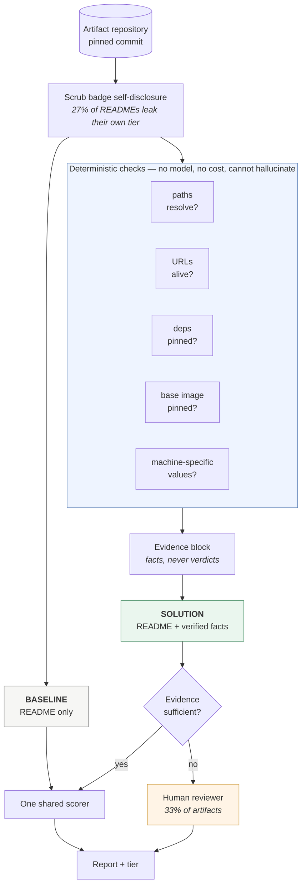

# Artifact Reproducibility Triage

**Does this research artifact actually do what its README says?**

A coding-agent workflow that checks a research repository's own claims against
its real file tree, and routes what it cannot settle to a human. Built for the
micro1 Frontier Engineering Challenge 2026.

```bash
artifact-triage owner/repo     # ~5 seconds, no API key, no cost
```

---

## Results at a glance

| | |
|---|---|
| **Detecting a falsified README** | baseline **0%** → solution **100%** (3 trials, 100–100%) |
| **Deterministic verifier** | **75/75** injected false claims, **0** false positives |
| **Prevalence in the wild** | **65.3%** of 376 research artifacts carry a broken README claim |
| | **829 of 4,261** documented file references (19.5%) resolve to nothing |
| **Is it decay?** | **No.** Flat with age — artifacts *ship* broken |
| **Model spend, entire project** | **$2.39** of a $5 ceiling (AWS actual) — five of six checks need no model at all |

Two results are reported that do **not** flatter the project, because omitting
them would make everything else less trustworthy:

- A **zero-skill constant predictor beats both systems** on ACM badge agreement.
  Badge agreement is uninformative here, and the write-up says so.
- The **external validation returned null.** Repositories we flag are no more
  likely to carry a user complaint than ones we do not.

---

## Contents

- [Who has this problem](#1-who-has-this-problem)
- [What bottleneck makes it worth solving](#2-what-bottleneck-makes-it-worth-solving) · [published evidence](#this-is-a-documented-problem-not-an-assumed-one)
- [Does the agent solve it well](#3-does-the-agent-solve-it-well) · [measured result](#measured-result) · [honest negative result](#honest-negative-result)
- [Prevalence across 376 artifacts](#prevalence-in-the-wild-across-376-artifacts) · [is it decay?](#the-defect-is-not-decay-artifacts-ship-broken)
- [Reproducing this](#4-can-another-person-reproduce-the-result)
- [Try it on your own repository](#try-it-on-your-own-repository)
- [Known limitations](#known-limitations-found-by-running-the-tool-on-itself)
- [Main failure mode](#main-failure-mode) · [Hot take](#hot-take)

## 1. Who has this problem?

Two groups, with the same underlying need:

**Artifact Evaluation Committee reviewers.** Every major software-engineering
conference (ICSE, ISSTA, ASE, FSE) runs an artifact track. Volunteer reviewers —
usually PhD students — are each assigned several artifacts and must decide
whether each is *Functional* (documented, consistent, complete, exercisable) or
*Reusable* (significantly exceeding minimal functionality). Committees are
chronically short of reviewers, and the work is unpaid.

**Researchers deciding what to build on.** Before investing a week reproducing a
baseline, you want to know whether the artifact will actually run.

## 2. What bottleneck makes it worth solving?

A README is a set of promises. Nothing checks them.

An artifact's documentation says "install with `requirements.txt`", "run
`scripts/run_experiments.sh`", "see `configs/default.yaml`". A reviewer reads
fluent, confident, well-structured prose and forms an impression — because
reading prose is what a human reviewer can cheaply do. Verifying that each named
file *exists* means cross-referencing dozens of paths against a repository that
may hold tens of thousands of files.

So the failure mode is specific and expensive: **a convincing README that is not
consistent with its own repository**. That gap is invisible to a reader and
obvious to a checker. In this corpus, one Reusable-badged artifact references
**15 files that do not exist**.

This is also the failure mode the whole challenge is about — output that is
convincing rather than correct.

### This is a documented problem, not an assumed one

Published measurements of research-artifact quality, independent of this project:

| Finding | Source |
|---|---|
| **Over 40% of "functional" artifacts from 2024–2025 fail within months** — drifting dependencies, unpinned versions, incomplete environments | [arXiv 2512.00651](https://arxiv.org/html/2512.00651v1) |
| **62.6% of artifacts break at least once** during study | [ICSE'23, Zhu et al.](https://web.cs.ucdavis.edu/~rubio/includes/icse23.pdf) |
| Only **56.4% of artifacts were reachable** at the links their papers gave | [arXiv 2404.06852](https://arxiv.org/pdf/2404.06852) |
| **Link rot averages 9.4%**, reaching 29.8% in some years | [arXiv 2404.06852](https://arxiv.org/pdf/2404.06852) |
| README quality averaged **49.8%** across 2017–2022 | [arXiv 2404.06852](https://arxiv.org/pdf/2404.06852) |

Two consequences shape this project.

**First, the failure is temporal.** An artifact badged `Functional` in 2024 may not
be functional now. That is not label noise — it is the phenomenon. It also
explains the badge-comparison result below, and it is why the project measures
*current* consistency rather than trying to recover a past verdict.

**Second, nothing above measures whether an artifact's README is consistent with
its own repository.** The literature measures availability, link rot, and
documentation presence. Whether the instructions *point at files that exist* is
the gap this tool fills.

### Independent replication

Running our link checker over the labelled corpus found **10 dead URLs out of 85
checked (11.8%)**, with **4 of 15 artifacts (27%) carrying at least one dead
link** — inside the published 9.4% average and 1.8–29.8% range. Reproducing a
known measurement with an independent implementation is evidence the tool
measures something real.

## 3. Does the agent solve it well?



Both systems receive the identical scrubbed README and the identical rubric, and
are scored by one shared scorer. The **only** difference is the evidence block —
which is what makes the measured gap attributable to evidence rather than to
anything else.


### The baseline (a fair one)

One direct prompt: the scrubbed README plus the ACM badge rubric, asked for a
tier. Same model, same rubric, same output schema, same README the solution sees.
It is what a reviewer actually does today — read the documentation and judge.

### The solution

Before the model sees anything, **every file path the README references is
checked against the repository's real file tree**. Those results are placed in the
prompt as established fact, and the model is instructed to weigh verified facts
above the README's own claims.

The verification is ordinary deterministic Python. It cannot hallucinate, costs
nothing, and every finding is citable by path. The model then reasons over
*evidence* instead of over *prose*.

Low-confidence answers are **escalated to a human reviewer** rather than recorded
as guesses — the product working as intended, not a failure.

### Measured result

Agreement with expert badges turned out to be uninformative, and we can prove it
rather than assert it — see *Honest negative result* below. The primary
experiment instead uses ground truth we author ourselves: each artifact is paired
with a **falsified twin** whose README references five files that provably do not
exist.

Same model, same rubric, same input pair. Only the evidence differs.

| Metric | Baseline | Solution |
|---|---|---|
| Noticed the falsified README | **0%** | **100%** |
| Range over 3 trials | 0% – 0% | 100% – 100% |
| Per-trial | `[0.0, 0.0, 0.0]` | `[1.0, 1.0, 1.0]` |
| Deterministic verifier | — | **75/75 claims (100%), 0 false positives** |

The baseline is *perfectly stable at zero*: across 45 opportunities it never once
downgraded a repository whose documentation had been corrupted. That is not a
tuning gap. It reads only prose, so it has no mechanism capable of detecting a
fabricated path — the blindness is structural.

Rates are floor-adjusted: an artifact already rated `Available` (the lowest tier)
on clean input cannot be downgraded further, so it is outside the metric's reach.
Both raw and adjusted figures are reported and the excluded artifacts are named
in `results/falsified_run.json`.

Model: `us.amazon.nova-pro-v1:0` on AWS Bedrock. Total cost of the reported
experiment: **$0.42**. Cumulative project spend: **$2.39** of $5, verified against AWS billing.

### A harder control: near-misses, not inventions

Injecting obviously-fake paths is the easy case. Real breakage is a rename that
was never propagated. So a second control takes paths that genuinely **do** exist,
mutates them the way references actually go stale — `run.py` → `run_v2.py`,
`config/` → `configs/`, a file moved one level up — and rewrites the README to
use the stale form.

| | |
|---|---|
| Mutations introduced | 44 |
| Detected as broken | **40 (91%)** |
| Correct original file suggested | **32 (73%)** |

Harder than the invented-path control, and closer to what a stale README actually
looks like: each reference still reads correctly and differs from a working path
by a few characters.

### Ablation: does the strict extractor earn its complexity?

The path extractor is fussier than "does it contain a dot" — an extension
whitelist, a rejection rule for dotted identifiers, a version-number guard. That
machinery has to justify itself, so it was measured against the naive rule it
replaced.

| | naive | strict |
|---|---|---|
| Recall on 75 known falsehoods | **100%** | **100%** |
| Tokens extracted as paths, unmodified READMEs | 307 | 145 |
| Flagged as broken documentation | **195** | **35** |

Identical recall; 160 fewer findings. There is no ground truth for those extras,
so they are shown rather than scored — `zenodo.org`, `20.04`, `3.7.4`,
`FF_DRIVER_NAME.final.bc`, `dl.acm.org/doi/abs/10.1145/...`.

Domains, version numbers and compiler artifacts are not broken documentation. A
checker that reports 195 defects where 35 exist gets switched off, so suppressing
them is not polish — it is the job.

### Honest negative result

The evaluation this project *started* with — predicting ACM badge tier — does not
work, and the write-up keeps it visible rather than quietly dropping it.

| System | MAE (badge tiers, lower better) |
|---|---|
| Constant predictor, always `"Functional"` | **0.667** |
| Baseline | 0.733 |
| Solution | 1.000 |

**A zero-skill constant beats both systems.** The baseline only appeared better
because it collapsed onto the middle class (14 of 15 predictions), which MAE
rewards on a 3-class ordinal problem.

The cause is a ground-truth mismatch: the committee badged the curated **Zenodo
deposit**, while we analyse the living **GitHub mirror**, where README drift is
normal. The verifier is behaving correctly and being penalised for it — `LPR`
genuinely has 15 of 17 README paths missing, the solution correctly downgrades
it, and its badge says `Reusable`.

### Prevalence in the wild across 376 artifacts

The verifier needs no labels and no model, so it can be pointed at every artifact
we could find. Harvested 398 research-artifact repositories from Zenodo across
venues; 376 profiled successfully.

| | |
|---|---|
| Artifacts with **≥1 broken README claim** | **224 / 343 (65.3%)** |
| Claims checked | 4,261 |
| Claims that resolve to nothing | **829 (19.5%)** |
| Median broken-claim ratio | 0.125 |

Reproducibility infrastructure across the same 376:

| Signal | Present |
|---|---|
| Licence | 88% |
| Dependency manifest | 67% |
| CI configuration | 44% |
| Tests | 37% |
| Container definition | 27% |

### The defect is not decay: artifacts ship broken

The literature attributes artifact failure to *drift*: dependencies moving under
a project over months. That predicts older artifacts should carry more broken
claims. They do not.

| Age bucket | n | Median age | Broken-claim ratio |
|---|---|---|---|
| under 3 months | 293 | 1d | 0.248 |
| 3–12 months | 35 | 161d | 0.224 |
| 1–2 years | 8 | 614d | 0.249 |

**Flat** (delta +0.001 across buckets). Broken path claims are present at
publication, not acquired over time — so they are not explained by dependency
drift, and **a reviewer could have caught every one of them on day one**. That is
what makes a mechanical check worth running at review time rather than as
post-hoc archaeology.

*(Caveat reported with the result: the oldest bucket has n=8. Zenodo's recency
sort skews the corpus toward new deposits.)*

### A null result, reported as one

I wanted an independent check that the defect matters to real people, so I
compared GitHub reproduction-complaint rates ("file not found", "cannot
reproduce") between repositories the verifier flags and those it does not. The
falsification condition was written down **before** the measurement.

| | Flagged | Clean |
|---|---|---|
| Share with a reproduction complaint | 37.1% | 37.5% |
| Median issue count | 24 | 20 |

**Indistinguishable.** The hypothesis is not supported.

The reason is visible in the sample: **only 43 of 120 repositories (36%) have any
issues at all**. A GitHub issue requires someone to try the artifact, hit the
problem, and take the time to write it up. Most research artifacts are published
and never exercised — so silence is not evidence that they work, and user
complaints are a weak instrument for validating a defect detector regardless of
which way the numbers fall.

That is arguably the more useful finding: the artifacts are not being used enough
for their defects to surface socially. Which is exactly why a mechanical check has
to run at review time, when there is still a human paying attention.

## 4. Can another person reproduce the result?

Yes, from a clean environment, in seconds and offline. See
[REPRODUCTION.md](REPRODUCTION.md).

Every API response is cached into committed fixtures, so `make repro` never
re-scrapes Zenodo, never clones a repository, and never depends on a rate limit.
Artifacts are pinned to explicit commit SHAs.

---

## Ground truth

Labels are **ACM Artifact Evaluation badges from ISSTA 2024** — assigned by an
expert committee, published, and entirely independent of this project. The corpus
is 15 artifacts whose repository links the authors themselves published in their
Zenodo deposits.

Badges are ordinal: `Available` (0) < `Functional` (1) < `Reusable` (2).

**An honest caveat, stated up front.** `Available` involves *no quality
evaluation* — it means "archived". So `Available` vs `Functional` is partly a
question of what the authors applied for, not of quality. Only
`Functional → Reusable` is a true expert quality ordering, and the results are
read with that in mind.

### Leakage defence

27% of the corpus (4 of 15) announced its own badge tier inside its README. Those
spans are redacted before any model sees them, and the scrubber carries an
executable post-condition asserting no tier word survives. A scrubber that is
merely *believed* to work is worth nothing.

---

## Metrics

Primary is **Mean Absolute Rank Error (MAE)** in badge tiers — badges are ordinal,
so one tier off is meaningfully better than two, which plain accuracy discards.

The task is asymmetric, as triage always is: calling an unevaluated artifact
*Reusable* tells a researcher to build on something never checked to work, while
the reverse merely wastes some time. **Overclaim rate** is therefore reported
separately rather than averaged away.

---

## Try it on your own repository

The deterministic path needs **no API key, no cost, and about five seconds**:

```bash
uv venv && uv pip install -e .
artifact-triage <owner>/<repo>
```

Point it at any research artifact — including your own — and it reports which of
the README's file references actually resolve, which URLs are dead, and what
reproducibility infrastructure is present. Add `--model` for a tier assessment
and an escalation recommendation.

Real output, abridged:

```
# Artifact reproducibility report — `zhangxiaosa/LPR`
Generated against commit `1cd376048ae5`.

## Verdict: 2 issue(s) need attention
- 15 README path(s) that do not exist
- no dependency manifest

`17` file path(s) referenced, checked against `31,020` files.

| Referenced in README        | Present in repository |
|-----------------------------|-----------------------|
| `scripts/run_lpr.py`        | **no**                |
| `scripts/run_perses.py`     | **no**                |
| `token_counter_deploy.jar`  | **no**                |
…
```

Every report ends with a **Not checked** section stating plainly what the tool
does not verify. A reviewer who cannot see a tool's limits cannot responsibly use
its output.

## Repository layout

```
src/artifact_triage/
  cli.py                    artifact-triage <owner/repo> — the user-facing tool
  corpus/     sources.py    scrape expert badge labels
              zenodo.py     resolve artifacts to their deposits
              discover.py   harvest 398 artifact repos at scale
              github.py     repo metadata
              fetch.py      scrubbed fact sheets (tree API, zero disk)
              scrub.py      redact badge self-disclosure
  baseline/   run.py        one direct prompt over the README
  solution/   verify.py     deterministic claim verification
              links.py      link-rot checking
              run.py        judge verified facts, escalate the uncertain
  eval/       metrics.py    one scorer, shared by both systems
              negative_control.py   injected-falsehood test
              falsified_run.py      the primary experiment
              prevalence.py         how widespread is the defect?
              issue_validation.py   do real users complain about it?
              export_trajectories.py
tests/        test_regressions.py   18 tests pinning every fixed bug
```

```bash
make test         # 18 regression tests, no credentials, ~2s
make report REPO=owner/name
make prevalence   # measure the defect across 398 artifacts
make links        # link-rot scan
```

`baseline` and `solution` feed a **single shared scorer**. Fairness is structural:
there is no code path by which one side is scored differently from the other.

---

## Improvement Changelog

See [CHANGELOG.md](CHANGELOG.md) — every iteration, the evidence that prompted it,
and what was decided, including the experiments that were removed.

## Known limitations, found by running the tool on itself

`make selfcheck` points the tool at this repository. It found three things.

**Two were real and are fixed.** No `LICENSE` and no CI configuration — the tool
flagged its own author for exactly the category of omission it flags in others.

**One was a false positive, and it is a genuine limitation.** All six "broken
paths" it reported in this README are **quotations from other artifacts**:
`scripts/run_lpr.py` and `token_counter_deploy.jar` belong to LPR and appear as
example output; `configs/default.yaml` comes from the negative-control injection
list. The checker cannot tell a claim about *this* repository from a quotation
about another one.

This is **meta-documentation**, and no artifact in the 376-repository corpus
exhibits it — every one of them describes only itself. Only pointing the tool at
itself could surface it.

The mitigation is a declared-exceptions file, `.artifact-triage-ignore`, with one
rule: **the report always states how many exceptions were applied.** A silent
suppression would be worse than the false positive it hides, because it would
make the tool's own output unfalsifiable — which is the failure this project
exists to detect.

## Main failure mode

**The verifier only checks claims that are shaped like file paths.**

It answers one question extremely well — *does this named file exist?* — with
100% detection and zero false positives. It cannot touch the claims that matter
most: *"this reproduces Table 3"*, *"results match the paper within 2%"*,
*"tested on Ubuntu 22.04"*. Those are semantic, and verifying them requires
actually running the artifact.

So a README could pass every check here and still be useless: every path resolves,
every script exists, and the pipeline produces numbers unrelated to the paper.
The system narrows a reviewer's search; it does not replace the reviewer. That is
why low-confidence cases escalate to a human rather than resolving to a guess.

Two narrower limits, both measured rather than assumed:

- **We analyse the GitHub mirror, not the archived deposit that was evaluated.**
  This is what invalidated the badge comparison, and it is stated in the results
  rather than buried.
- **n = 15.** ISSTA 2024 was the only venue found publishing machine-readable
  badge outcomes; other conferences document the criteria but not the results.

## Hot take

**Be as sceptical of your agent's bad news as of its good news.**

Everyone knows to distrust a result that flatters the system. That instinct is
real and it works — when the falsified-detection rate came back at 97%, I ran it
three times and reported the range.

The instinct fails in the other direction, and that is where this project kept
getting hurt. **Every measurement bug I found skewed low**, and each survived
review for the same reason:

| Bug | Reported | Actually |
|---|---|---|
| File trees truncated at 4,000 paths | phantom broken claims | inflated by my own cap |
| RFC1918 regex demanding 5 octets | 0 findings | pattern could never fire |
| Escalation gated on model confidence | 0/15 escalations | gate wired to a signal carrying no information |
| Suggestions scored by string equality | 39% accurate | **73%** |

A suggester at 39% reads as *promising but limited* — plausible, modest,
publishable. Nobody digs into a disappointing number. Had that same bug inflated
it to 99%, I would have checked within a minute.

So the asymmetry is in the reviewer, not the code: **I interrogated results that
made the system look good and accepted results that made it look bad**, because
accepting bad news feels like integrity. It is the cheapest possible way to be
wrong while feeling rigorous.

The practical rule: **a surprising number is a bug report until proven otherwise,
in whichever direction it surprises you.** Every genuine defect here was found by
a control — the negative control, the constant predictor, the subtle-mutation
control — and not one was visible in the headline metric. If you cannot state
what result would prove your metric worthless, you do not yet know what it
measures.

And the failure this project detects — *convincing rather than correct* — has an
exact analogue one level up. A README that documents files it does not contain,
and an evaluation that reports numbers it has not checked, are the same mistake.
This repository shipped both: a Makefile documenting a module that was never
written, and a report that listed five missing files then declared every path
found.
